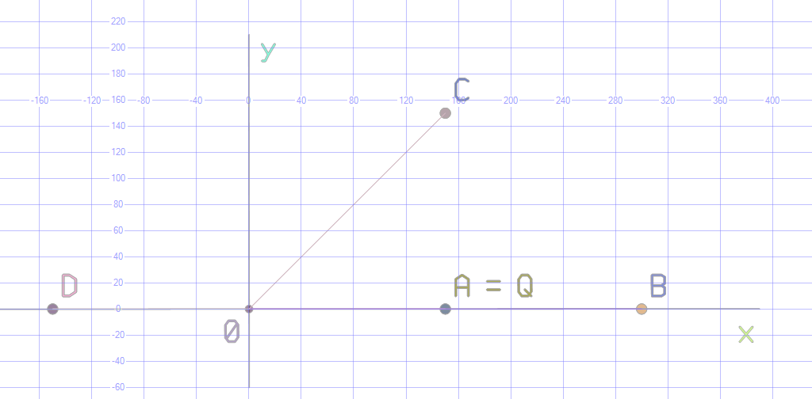

# TSQLViz

Draw SQL query results directly in SQL Server Management Studio.

TSQLViz is an experiment in building a reusable visualization toolkit in T-SQL. Small tools for geometry, text and scales support layout helpers, which in turn support complete charts and diagnostic views. The goal is to make a wide range of custom visualizations possible with little repeated SQL.

The output is a regular `geometry` column, which SSMS displays in its **Spatial Results** tab. You can draw directly with a `SELECT`, combine helpers into your own visualization, or use one of the built-in charts.

An AI agent can also prepare a **reviewable T-SQL artifact outside a restricted production environment**, where a consultant can use only approved SQL scripts. The human reviews and transfers the SQL, and it runs against local data with preinstalled TSQLViz and SSMS Spatial Results. No AI service or additional network connection is needed at runtime. Start with the [agent guide](docs/agent-guide.md), [safety boundary](docs/agent-safety.md) and [runnable agent examples](examples/agents/README.md). Agent discovery starts at [llms.txt](llms.txt) and [AGENTS.md](AGENTS.md).

**Very early, experimental version. The API is not stable.** Function and procedure signatures, data types, defaults and rendering behavior may change between versions, including breaking changes. Expect to adapt your scripts when upgrading. The examples are starting points for experimentation and feedback.

## A toolkit you can build on

The tools are arranged in layers. Each layer gives you reusable pieces for building the next:

| Layer | What it provides | Examples |
|---|---|---|
| Shapes and text | Draw lines, areas, points and labels | `Segment`, `Rect`, `Circle`, `Text` |
| Scales and ticks | Map data values to positions and sizes; generate tick values | `ScaleLinear`, `ScaleLog`, `ScaleBand`, `BubbleRadius`, `TicksLinear` |
| Layout and composition | Assemble axes, labels and shapes into a shared scene | `AxisBottom`, `AxisLeft`, `Canvas`, `Scene_v1`, `RenderScene` |
| Charts and recipes | Combine those tools into complete views of a dataset | `BarChart`, `LineChart`, `BubbleChart`, Query Store and DMV examples |

Use whichever level fits your idea, and mix levels when useful. A small diagram may need only shapes and text. A custom plot can reuse scales and axes while defining its own marks. You can also add your own geometry to the output of a chart procedure.

The built-in charts demonstrate what can be assembled from these tools. Your own visualization can use the same pieces without adding a new chart procedure to the library. You supply the data and decide how to represent it; TSQLViz provides the reusable drawing and layout work. What you can display remains subject to the SSMS viewer's limits.

The [dot plot tutorial](docs/tutorial.md) walks through this approach, from individual shapes to a complete custom plot.

## Get started

You need SQL Server 2017 or later, database compatibility level 140 or higher, and SSMS. SSMS 22 is the primary tested viewer; validation for SSMS 21 is still ongoing.

1. Choose a database for the library, such as a dedicated utility database.
2. Open [dist/install.sql](dist/install.sql) in SSMS and execute the whole script in that database. Installation requires DDL permissions. SQLCMD mode is not needed.
3. Run the example below in the same database with **Results to Grid** selected.
4. Open **Spatial Results** and select `Shape` as the spatial column.

Set **Tools > Options > Query Results > SQL Server > Results to Grid > Maximum Characters Retrieved > Non XML data** to at least **65535**. Turn native labels and the viewer grid off when viewing TSQLViz charts. TSQLViz draws its own labels as geometry.

## A picture is just a query

We chose vectors for this introduction because Sascha (It's me.) needed a small visual demo for his talk on native vector support in SQL Server 2025 at the [SQL Server community meetup in Hamburg](https://www.meetup.com/de-de/hamburger-ms-sql-server-usergroup-by-pass-deutschland-e-v/events/316675799/) on Wednesday, 7 October 2026. It is a practical example of composing a custom visualization from just a few TSQLViz tools.

This example draws four 2D vectors. Each gets a line from the origin, an endpoint and a name.

```sql
WITH vectors AS
(
    SELECT * FROM (VALUES
        (N'A = Q', 1.0, 0.0), (N'B', 2.0, 0.0),
        (N'C',     1.0, 1.0), (N'D', -1.0, 0.0)
    ) AS v(label, x, y)
)
SELECT label, drawing.Shape
FROM vectors
CROSS APPLY (VALUES
    (viz.Segment(0, 0, 150*x, 150*y)),
    (viz.Circle(150*x, 150*y, 4)),
    (viz.Text(label, 150*x + 8, 150*y + 10, 16, 0))
) AS drawing(Shape);
```

Both coordinates use the same drawing scale, so angles and length ratios stay intact. Replace the `VALUES` rows with your own query. Each function returns an ordinary `geometry` value, so you can combine shapes with `CROSS APPLY`, `UNION ALL` or the chart procedures.



The [native vector example](examples/synthetic/07-vectors.sql) reads a `dbo.VectorDemo` table with a `vector(2)` column and adds axes. That example requires SQL Server 2025 or later and an existing table populated with the four demo vectors. The screenshot includes the SSMS viewer grid.

## Choose a starting point

| What you want to draw | Example |
|---|---|
| Positive, negative, zero and missing values | [Bar chart](examples/synthetic/01-bars.sql) |
| Time series with a gap and a UTC day boundary | [Line chart](examples/synthetic/02-lines.sql) |
| Frequency, cost per execution and total cost | [Bubble chart](examples/synthetic/03-workload.sql) |
| Your own combination of charts, shapes and text | [Composition](examples/synthetic/04-composition.sql) |
| A custom chart, built step by step | [Dot plot tutorial](docs/tutorial.md) |
| SQL prepared by an AI agent for a restricted environment | [Agent artifact examples](examples/agents/README.md) |

The [workbook](docs/stack-training.md) contains 24 runnable SQL examples, exercises and a public API reference. The [Core reference](src/core/README.md) describes geometry and scales; the [Charts reference](src/charts/README.md) covers chart procedures, text and layout.

## Use SQL Server data

Examples also cover common diagnostic queries:

- [Query Store plan duration](examples/query-store/plan-duration.sql) and [query CPU with execution counts](examples/query-store/query-cpu-bubbles.sql). See the [Query Store guide](examples/query-store/README.md) for configuration and permissions.
- [Wait statistics over a measured interval](examples/dmvs/waits.sql).
- [Plan cache workload](examples/dmvs/query-workload.sql), with [detail pages from the same snapshot](examples/dmvs/query-workload-detail.sql). Run the detail script in the same connection after the workload script.

The wait and plan cache examples include a synthetic mode for trying the charts without server diagnostic permissions. Reading real diagnostic data requires the source's normal permissions.

An optional [BlitzCache adapter](src/adapters/frk/README.md) adds a workload map. Install [dist/install-frk-adapter.sql](dist/install-frk-adapter.sql) after the main library, then try the [synthetic example](examples/frk/synthetic-workload.sql). The [real capture example](examples/frk/capture-blitzcache.sql) requires a separately installed `sp_BlitzCache` at the exact 8.34 commit specified by the adapter. Existing captures can be explored with the [detail example](examples/frk/detail-workload.sql).

## Installation and access

The combined installer includes Core and Charts. For separate installation, run [install-core.sql](dist/install-core.sql) followed by [install-charts.sql](dist/install-charts.sql).

For restricted environments, installation and access assignment are separate, reviewed DBA steps. Agent-generated consumer scripts assume the library is already installed; this workflow does **not** offer a zero-install mode. Data acquisition permissions and cost review remain separate from visualization. The agent does not need customer credentials or a connection to PROD.

After installation, grant an existing database user access to the library:

```sql
ALTER ROLE viz_user ADD MEMBER [YourDatabaseUser];
```

Synthetic examples need library access only. Access to your source tables, DMVs or Query Store is separate. For scalar functions in a utility database, use a three-part name such as `_SQLMaint.viz.Circle(...)`; the Query Store examples show how to use charts across databases.

To remove the library, uninstall the optional [FRK adapter](dist/uninstall-frk-adapter.sql) first, then [Charts](dist/uninstall-charts.sql), then [Core](dist/uninstall-core.sql). Uninstallation checks dependencies and keeps source tables. See the [adapter guide](src/adapters/frk/README.md) before removing registered capture metadata.

## Current status and limits

The current installer version is `0.1.0-s5a`; the first public v0.1 release is still being prepared. The tests below describe what has been checked in the current implementation. They do not imply a stable API or a compatibility guarantee for future versions.

- Core and chart SQL tests have passed on SQL Server 2017, 2019, 2022 and 2025. SQL validation and visual validation are recorded separately.
- Some chart layouts still need work. Long context sections can shrink the plot through SSMS autozoom, zero markers can be hard to see, and line label connectors can resemble additional data. See the [validation summary](docs/validation.md).
- SSMS chooses colors. Use labels and the legend in the current chart rather than assigning meaning to a particular palette color. The viewer provides a static picture; it has no interactive drilldown.
- Large scenes are subject to geometry and viewer limits. The chart procedures validate their budgets; direct calls to shape functions do not perform scene validation. See the [rendering contract](docs/rendering.md).
- `viz.Line` and `viz.TreeMap` are experimental prototypes requiring separate installation. They are not included in `dist/install.sql`. Start with their [line example](examples/synthetic/05-quick-line.prototype.sql) or [treemap example](examples/synthetic/06-treemap.prototype.sql) and read the linked source instructions.

## License

Copyright (c) 2026 PSG Projekt Service Gesellschaft für Systemberatung und Softwareentwicklung mbH.

TSQLViz is licensed under the [MIT License](LICENSE). You can use, modify and distribute it, including in commercial projects, provided you retain the copyright and license notice.

External tools used by the examples are installed separately and retain their own licenses.

## Development

See the [development guide](docs/development.md) for build and test commands, the [validation summary](docs/validation.md) for recorded results and open issues, and the [data contracts](docs/data-contracts.md) for the current interfaces. Internal project specifications and archived test runs are excluded from this repository.
