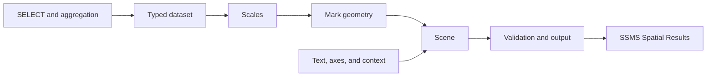

# Learning the TSQLViz stack

A practical path from your first chart to your own visualization in T-SQL

Edition: 16 September 2026 · Core and Charts interfaces: `0.1.0-s5a`

This workbook is for SQL developers and DBAs who know `SELECT`, joins, aggregation, and table variables. You do not need experience with spatial data or graphics programming. Every dataset is created within the exercises. No community tools or server DMVs are required.

By the end, you will be able to visualize your own query results, explain their meaning within the image, and compose an additional chart type from public TSQLViz building blocks.

## Learning path

We start with a complete chart so that you can connect data to an image immediately. We then open that chart one layer at a time: data contracts, context, scales, geometry, text, axes, and scenes. The final project builds a dot plot from those same parts.

This sequence keeps the initial workload manageable. You do not need to construct geometry or learn every option before seeing a result. When you eventually draw your own marks, you can relate each decision to a chart you already understand.

| Stage | Chapters | What you will be able to do |
|---|---|---|
| Get started | 1–3 | Install the stack, display a chart, and explain the data flow |
| Prepare meaningful data | 4–5 | Define identity, aggregation, missing values, and visible context |
| Use the existing charts | 6–7 | Create time series, bubbles, scatter plots, and static detail views |
| Understand the building blocks | 8–11 | Map values to coordinates and construct geometry, text, and axes |
| Create a visualization | 12–13 | Extend a scene and build a dot plot |
| Make it dependable | 14–16 | Diagnose errors, inspect budgets, and structure an extension |

For a guided course, plan three sessions of roughly 90–120 minutes: chapters 1–5, chapters 6–11, and chapters 12–16. These are teaching estimates, not measured completion times. Use the exercises for individual practice between sessions.

### How to run the examples

Each `sql` code block is an independent example for your selected training database. Select and execute the entire block. No variables from earlier blocks are required. An exercise may ask you to change a previous example; those changes are optional experiments, not prerequisites for later chapters.

Some examples deliberately isolate one mechanism and omit full context. They are identified as technical exercises. The complete analytical charts and final project include provenance, a time basis, a reading guide, and a limit on interpretation.

The examples use explicit column lists when introducing a contract. Later examples sometimes use the documented column order to keep the graphics logic readable. In application code, explicit column lists usually make maintenance easier.

### Contents

1. [Prepare your environment](#chapter-1)
2. [Understand the data flow](#chapter-2)
3. [Draw your first bar chart](#chapter-3)
4. [Turn SELECT results into datasets](#chapter-4)
5. [Give the image context and identity](#chapter-5)
6. [Work with time series and gaps](#chapter-6)
7. [Use bubbles, scatter plots, and detail views](#chapter-7)
8. [Map values with scales](#chapter-8)
9. [Build geometry and scenes](#chapter-9)
10. [Draw and measure text](#chapter-10)
11. [Build axes](#chapter-11)
12. [Compose an existing chart](#chapter-12)
13. [Final project: build a dot plot](#chapter-13)
14. [Understand errors and limits](#chapter-14)
15. [Validate and measure your work](#chapter-15)
16. [Structure your own building blocks](#chapter-16)
17. [Practice tasks and solution notes](#practice)
18. [Reference sheet](#reference)

<a id="chapter-1"></a>
## 1. Prepare your environment

Learning objective: distinguish the SQL Server installation from the SSMS display settings.

### 1.1 Requirements and installation

Use SQL Server 2017 or later, compatibility level 140 or higher, and a dedicated user database for training. After installation, the examples can run with the `viz_user` database role. Installation and role assignment require suitable database administration permissions.

At runtime, TSQLViz consists of T-SQL objects and SQL Server's `geometry` type. SSMS Spatial Results displays the output. The installation does not require a browser, an add-in, or an additional CLR assembly. PowerShell and Docker support development and repeatable testing; they are not required to use an already installed library.

1. Open an SSMS connection to your chosen training database.
2. Execute [dist/install.sql](../dist/install.sql) in full. SQLCMD mode is not needed.
3. If necessary, have an administrator add an existing database user to `viz_user`. The administrative command is `ALTER ROLE viz_user ADD MEMBER [YourDatabaseUser];`.
4. Select **Results to Grid**.
5. Set **Maximum Characters Retrieved / Non XML Data** to at least **65,535** in the query result settings. Open a new query window if necessary after changing the setting.
6. When a chart returns, select **Spatial Results** and the `Shape` column. Turn native labels and the viewer grid off; TSQLViz supplies its own labels and axes.

Check the selected database and available objects:

<!-- training-example: 01-environment -->
```sql
SELECT
    DB_NAME() AS DatabaseName,
    SERVERPROPERTY('ProductVersion') AS EngineVersion,
    compatibility_level AS CompatibilityLevel
FROM sys.databases
WHERE name = DB_NAME();

SELECT
    TYPE_ID(N'viz.Scene_v1') AS SceneTypeId,
    OBJECT_ID(N'viz.BarChart', N'P') AS BarChartObjectId,
    OBJECT_ID(N'viz.AnnotateScene', N'P') AS AnnotateSceneObjectId,
    viz.ScaleLinear(5, 0, 10, 0, 100, 0) AS ScaleSmoke;
```

Expected: the object IDs are not `NULL`, and `ScaleSmoke` is `50`. If objects are missing, check the selected database, installation, and permissions first. Do not change an unrelated application database's compatibility setting for this course.

### 1.2 What a successful example proves

Successful execution proves that SQL Server processed the example. It does not establish that the image is readable in your SSMS window. Inspect the picture as well as the resultset.

The current S5a implementation has known display issues. A long context area can cause autozoom to shrink the whole image. Zero markers can be difficult to distinguish. A connector to a line's end label can resemble an extension of the measured series. The [validation summary](validation.md) document these cases. This workbook teaches the available implementation without treating its visual acceptance as complete.

<a id="chapter-2"></a>
## 2. Understand the data flow

Learning objective: assign each operation to the correct layer.

The composition approach has something in common with D3: data maps to visual properties, scales translate values into positions, and small drawing primitives combine into charts. That shared idea is enough for this course. There is no D3 API to learn here.

In TSQLViz, you express that work relationally. `INSERT … SELECT` can create one mark per data row. Table-valued functions return tick or geometry rows. A scene collects the result. Calling the code again calculates a new scene; there is no persistent document tree with events and animations.



| Term | Meaning in TSQLViz |
|---|---|
| Dataset | Business observations in an appropriate `viz.*_v1` table type |
| Domain | Data range, such as 0 to 100 ms |
| Range | Drawing range, such as X = 160 to 900 |
| Mark | A visual representation of data: a bar, circle, or line segment |
| Scene | A table containing geometry, ordering, and references to data |
| Canvas | Drawing frame and coordinate space; its units are not screen pixels |
| Context | Visible information about the meaning and provenance of data |
| Renderer | Validates a scene and returns an ordered resultset |

There are two entry points:

- **Chart level:** pass a dataset to `viz.BarChart`, `viz.LineChart`, or `viz.BubbleChart`. The procedure handles domains, marks, labels, and output.
- **Scene level:** create rows yourself with the public scale, geometry, and text helpers. Finish with `viz.RenderScene` or `viz.AnnotateScene`.

The data contract is explicit at both levels. A chart does not execute an arbitrary query string or read your application tables. Before calling it, you decide which rows and units the picture represents.

**Checkpoint:** Where does `SUM(DurationMs)` belong? In data preparation, when a mark is supposed to represent a sum. Neither `ScaleLinear` nor `Rect` knows that business decision.

<a id="chapter-3"></a>
## 3. Draw your first bar chart

Learning objective: render a chart and distinguish a negative value, an observed zero, and a missing value.

This is a technical starter exercise without full context. Chapter 5 provides the complete pattern.

<!-- training-example: 02-first-bar -->
```sql
DECLARE @Data viz.CategoryValue_v1;

INSERT @Data
    (ItemKey, CategoryKey, CategoryLabel, CategoryOrder,
     SeriesKey, SeriesLabel, SeriesOrder, Value, DetailLabel)
VALUES
    (N'a', N'a', N'Decrease', 1, N'change', N'Change', 1, -5,   NULL),
    (N'b', N'b', N'Unchanged',2, N'change', N'Change', 1,  0,   NULL),
    (N'c', N'c', N'Increase', 3, N'change', N'Change', 1, 10,   NULL),
    (N'd', N'd', N'Unknown',  4, N'change', N'Change', 1, NULL, NULL);

EXEC viz.BarChart
    @Data = @Data,
    @Title = N'First chart: four different states',
    @ValueLabel = N'Change (units)';
```

The grid contains the scene resultset; Spatial Results contains the picture. The negative bar extends left from zero and the positive bar extends right. An observed `0` gets a zero marker. The unknown category remains listed but has no value bar.

The column list makes it easier to distinguish keys, order, and value. It also helps prevent accidentally swapping fields in later application code.

Change `10` to `20` and rerun the entire block. The chart recalculates its domain, so the positive bar does not necessarily become twice as long on screen. To compare separate views, you may need matching explicit domain bounds.

**Exercise:** Add `@ValueMin = -10, @ValueMax = 30` to the call. Then change only the positive value. Which features of the picture now remain stable?

<a id="chapter-4"></a>
## 4. Turn SELECT results into datasets

Learning objective: prepare the meaning of the data before drawing it.

### 4.1 Identity, labels, and order

`CategoryValue_v1` separates several questions:

| Question | Columns |
|---|---|
| Which observation is this? | `ItemKey` |
| Which category does it belong to, and what is its name? | `CategoryKey`, `CategoryLabel` |
| Where should the category appear? | `CategoryOrder` |
| Which series does it belong to? | `SeriesKey`, `SeriesLabel`, `SeriesOrder` |
| Which value is drawn? | `Value` |
| What additional description belongs to the observation? | `DetailLabel` |

The current BarChart accepts one series and at most one row per category. Aggregate multiple raw rows per category beforehand. `DetailLabel` alone does not guarantee a complete visible description; we use `ItemLabel_v1` for explicit visible identity later.

Keys use a binary collation. Treat `api` and `API` as distinct keys. Visible names may repeat, but `ItemKey` must be unique throughout one dataset.

Choose stable business keys. A running rank usually makes a poor identity: after sorting changes, the same key could identify a different object. Ordering and identity have separate fields for a reason.

### 4.2 Aggregate before calling the chart

Two synthetic captures contain execution counts and total CPU time. We want mean CPU per operation across both captures. The source unit is already milliseconds.

<!-- training-example: 03-normalize -->
```sql
DECLARE @Raw TABLE
(
    OperationKey nvarchar(200),
    OperationName nvarchar(400),
    ExecutionCount bigint,
    TotalCpuMs decimal(19,3)
);

INSERT @Raw VALUES
    (N'checkout', N'Checkout', 100, 200),
    (N'checkout', N'Checkout',   1, 100),
    (N'search',   N'Search',    20, 300),
    (N'search',   N'Search',    30, 300),
    (N'empty',    N'No executions', 0, 0);

DECLARE @Data viz.CategoryValue_v1;

;WITH Aggregated AS
(
    SELECT OperationKey, MAX(OperationName) AS OperationName,
           SUM(ExecutionCount) AS Executions,
           SUM(TotalCpuMs) AS CpuMs
    FROM @Raw
    GROUP BY OperationKey
)
INSERT @Data
    (ItemKey, CategoryKey, CategoryLabel, CategoryOrder,
     SeriesKey, SeriesLabel, SeriesOrder, Value, DetailLabel)
SELECT OperationKey, OperationKey, OperationName,
       CONVERT(int, ROW_NUMBER() OVER (ORDER BY OperationKey)),
       N'cpu', N'Mean CPU', 1,
       CONVERT(float, CpuMs / NULLIF(Executions, 0)),
       CONCAT(N'Executions=', Executions, N'; total CPU ms=', CpuMs)
FROM Aggregated;

SELECT ItemKey, CategoryLabel, Value AS MeanCpuMs, DetailLabel
FROM @Data
ORDER BY CategoryOrder;
```

Expected: Checkout has `300 / 101`, approximately `2.970297` ms per execution. Search has `600 / 50 = 12` ms. With zero executions, the mean remains `NULL`.

Averaging the two Checkout means would give `(2 + 100) / 2 = 51`. That is wrong for the combined population. TSQLViz cannot detect this semantic mistake; it draws the value you supply.

Here, `MAX(OperationName)` assumes a key always has the same name, which is true of the exercise data. With real data, resolve conflicting names first or obtain the name from a reference table.

### 4.3 Missing, zero, and excluded

| Case | Meaning | Treatment |
|---|---|---|
| Value is `0` | Observed and actually zero | Preserve `0` |
| Value is `NULL` | Observation exists but its value is unknown | Preserve `NULL` |
| Row is absent | No observation was supplied | Do not automatically interpret it as zero |
| Row was filtered out | Deliberate selection | Describe the selection and remainder in context |

Use `COALESCE(Value, 0)` only when the business meaning supports it. A tidier image is not a sufficient reason.

**Exercise:** Prepare total CPU instead of mean CPU. Which changes are needed in the output name, axis label, and eventual reading guide?

<a id="chapter-5"></a>
## 5. Give the image context and identity

Learning objective: make a chart understandable without reading its SQL.

### 5.1 Seven context fields

`viz.Context_v1` contains either no rows for a legacy minimal call or exactly these seven fields. Partially populated context is rejected.

| FieldKey | Question answered |
|---|---|
| `marks` | What does a mark represent? |
| `source` | Where did the data come from? |
| `time` | Which timestamp or interval does it describe? |
| `population` | What was selected, excluded, or aggregated? |
| `reading` | How should position, length, and area be read? |
| `observation` | What can be concluded from these particular data? |
| `limitation` | What conclusion is not supported? |

Each content value allows at most 350 UTF-16 code units, although the table type uses `nvarchar(400)`. The wider SQL type permits explicit validation. Use short, specific sentences. Long explanations enlarge the scene and may shrink its display in the viewer.

`ItemLabel_v1` adds `ItemKey`, a unique `Code`, and a complete `Name`. Codes contain 1–12 characters from `A-Z0-9`. `B1` and `QUERY12` are valid; `Q-1` and `q1` are not.

### 5.2 A complete bar chart

<!-- training-example: 04-context-bar -->
```sql
DECLARE @Data viz.CategoryValue_v1;
INSERT @Data
    (ItemKey, CategoryKey, CategoryLabel, CategoryOrder,
     SeriesKey, SeriesLabel, SeriesOrder, Value, DetailLabel)
VALUES
    (N'a', N'a', N'Service A', 1, N'delta', N'Change', 1, -5,   NULL),
    (N'b', N'b', N'Service B', 2, N'delta', N'Change', 1,  0,   NULL),
    (N'c', N'c', N'Service C', 3, N'delta', N'Change', 1, 10,   NULL),
    (N'd', N'd', N'Service D', 4, N'delta', N'Change', 1, NULL, NULL);

DECLARE @Items viz.ItemLabel_v1;
INSERT @Items (ItemKey, Code, Name) VALUES
    (N'a', 'B1', N'Service A'), (N'b', 'B2', N'Service B'),
    (N'c', 'B3', N'Service C'), (N'd', 'B4', N'Service D');

DECLARE @Context viz.Context_v1;
INSERT @Context (FieldKey, Content) VALUES
    ('marks', N'One bar represents the change in one service.'),
    ('source', N'Four synthetic training values.'),
    ('time', N'Demonstration without a real measurement interval.'),
    ('population', N'All four services; no selection or aggregation.'),
    ('reading', N'Length and direction from zero show change. Missing means unknown.'),
    ('observation', N'Calculated from the data below.'),
    ('limitation', N'These values do not describe a real server.');

UPDATE @Context
SET Content = CONCAT(
    N'Sum of known changes=',
    viz.FormatNumber((SELECT SUM(Value) FROM @Data), 'number', 2),
    N'; observed zeros=', (SELECT COUNT(*) FROM @Data WHERE Value = 0),
    N'; missing=', (SELECT COUNT(*) FROM @Data WHERE Value IS NULL), N'.')
WHERE FieldKey = 'observation';

EXEC viz.BarChart
    @Data = @Data,
    @Title = N'Which services changed?',
    @ValueLabel = N'Change (units)',
    @ValueMin = -10, @ValueMax = 20,
    @Context = @Context, @ItemLabels = @Items;
```

Expected: known changes total `5`. One zero and one missing value are reported separately. Category codes `B1` through `B4` resolve to names and values in the context area.

With context present, BarChart requires labels matching every input item exactly, including the row whose value is `NULL`. Extra labels are an error too.

The observation is computed from the data. Changing `10` updates the text automatically. A statement such as “Service C is unhealthy” would require evidence beyond these numbers.

### 5.3 What the library validates

The chart checks fields, keys, numeric ranges, and geometry. It cannot know whether milliseconds is the correct unit, whether the data came from the declared interval, or whether a selection is representative.

For multiple detail views, assign codes once to the complete source population. Then select data and labels together. The object retains its code when it appears on a different page.

**Exercise:** Give Service A and Service C the same visible name. Can a reader still distinguish them? Then delete Service D's label and inspect the defined error.

<a id="chapter-6"></a>
## 6. Work with time series and gaps

Learning objective: supply temporal order, UTC timestamps, and missing samples correctly.

### 6.1 The XY contract

`viz.XY_v1` contains `ItemKey`, `SeriesKey`, `SeriesLabel`, `SeriesOrder`, `PointOrder`, `X`, `Y`, `SizeValue`, and `DetailLabel`.

`PointOrder` defines order within a series. It must be unique per series, and for LineChart, X must not decrease along that order. Repeated X values are allowed. Different series may reuse a `PointOrder`; `ItemKey` remains unique throughout the dataset.

LineChart does not encode `SizeValue`. For a time axis, X contains integer milliseconds since **2000-01-01 UTC**. This is the TSQLViz epoch, not the Unix epoch.

### 6.2 Normalize timestamps explicitly

<!-- training-example: 05-time-conversion -->
```sql
DECLARE @WithOffset datetimeoffset(3) = '2026-09-16T12:00:00+02:00';
DECLARE @Utc datetime2(3) =
    CONVERT(datetime2(3), SWITCHOFFSET(@WithOffset, '+00:00'));
DECLARE @Epoch float = viz.TimeToEpoch(@Utc);

SELECT @WithOffset AS SourceTime, @Utc AS UtcTime,
       @Epoch AS TsqlvizEpochMs,
       viz.EpochToTime(@Epoch) AS RoundTrip,
       viz.FormatTime(@Epoch, 'utc-datetime') AS DisplayTime;

IF viz.EpochToTime(@Epoch) <> @Utc
    THROW 52000, 'Time roundtrip failed.', 1;
```

Expected: `12:00 +02:00` becomes `10:00 UTC`. A `datetime2` carries no time zone itself. Establish its meaning before calling the helper. Supported time values run from 1900-01-01 inclusive to 2101-01-01 exclusive.

### 6.3 Two series with an explicit gap

<!-- training-example: 06-line-gap -->
```sql
DECLARE @Data viz.XY_v1;
DECLARE @Start datetime2(3) = '2026-09-15T23:58:00';

INSERT @Data
    (ItemKey, SeriesKey, SeriesLabel, SeriesOrder,
     PointOrder, X, Y, SizeValue, DetailLabel)
SELECT CONCAT(s.K, N':', p.N), s.K, s.Name, s.Ord,
       p.N, viz.TimeToEpoch(DATEADD(minute, p.N, @Start)),
       CASE WHEN s.K = N'a' AND p.N = 2 THEN NULL
            ELSE 10 + p.N * s.Ord END,
       NULL, NULL
FROM (VALUES (0), (1), (2), (3), (4)) AS p(N)
CROSS JOIN (VALUES
    (N'a', N'Service A', 1),
    (N'b', N'Service B', 2)
) AS s(K, Name, Ord);

DECLARE @Context viz.Context_v1;
INSERT @Context VALUES
    ('marks', N'Each line connects snapshot counts for one service.'),
    ('source', N'Synthetic observations for two services.'),
    ('time', N'2026-09-15 23:58 to 2026-09-16 00:02 UTC; one-minute steps.'),
    ('population', N'Ten supplied observations; one has no measured value.'),
    ('reading', N'Compare counts at matching UTC times. NULL breaks the line.'),
    ('observation', CONCAT(N'Measured values=', (SELECT COUNT(Y) FROM @Data),
        N'; explicit gaps=', (SELECT COUNT(*) FROM @Data WHERE Y IS NULL), N'.')),
    ('limitation', N'Connecting lines do not add measurements.');

EXEC viz.LineChart
    @Data = @Data,
    @Title = N'How do the two counts change?',
    @XKind = 'time', @XFormat = 'utc-time',
    @XLabel = N'Time', @YLabel = N'Count',
    @Context = @Context;
```

Expected: nine measured values in two series, one gap in Service A, and a UTC date change. With context present, LineChart assigns series codes in binary `SeriesKey` order. Leave `@ItemLabels` empty: per-point identities through this parameter are not supported for LineChart.

**Experiment:** Replace the `CASE` with the ordinary value expression and remove that row using `WHERE NOT (s.K = N'a' AND p.N = 2)`. LineChart can now connect the remaining neighbors. An absent row does not declare an expected but missing sample. For regularly sampled data, you may need a complete time grid with a `LEFT JOIN` to observations first.

A long line may occupy several geometry rows. The chart splits large shapes without removing measurements. Scene row count is therefore not measurement count.

When series end at different times, inspect the final measured point. The current connector to an end label may look like a horizontal extension. Demonstrate this open layout issue explicitly during a guided session.

**Exercise:** End Service B one timestamp earlier. Inspect the actual data end, label connector, and context together. Describe what a reader can safely infer from the picture alone.

<a id="chapter-7"></a>
## 7. Use bubbles, scatter plots, and detail views

Learning objective: choose the right visual encoding and preserve identities when selecting detail rows.

### 7.1 Three values, three visual properties

A bubble uses X for horizontal position, Y for vertical position, and `SizeValue` for area. For a workload example, we deliberately assign:

| Dataset field | Meaning | Unit |
|---|---|---|
| X | Execution count | executions |
| Y | Mean CPU per execution | ms/execution |
| SizeValue | Total CPU | ms |

This is a convention of the example, not an implicit rule of `XY_v1`. A bubble could represent other quantities. The optional `WorkloadInsight` helper, however, specifically requires this CPU convention.

<!-- training-example: 07-bubble-detail -->
```sql
DECLARE @Data viz.XY_v1;
INSERT @Data
    (ItemKey, SeriesKey, SeriesLabel, SeriesOrder,
     PointOrder, X, Y, SizeValue, DetailLabel)
VALUES
    (N'q1', N'work', N'Statements', 1, 1, 1000,   2, 2000, NULL),
    (N'q2', N'work', N'Statements', 1, 2,   20, 100, 2000, NULL);

DECLARE @Items viz.ItemLabel_v1;
INSERT @Items VALUES
    (N'q1', 'Q1', N'Frequent small operation'),
    (N'q2', 'Q2', N'Infrequent expensive operation');

DECLARE @Context viz.Context_v1;
INSERT @Context VALUES
    ('marks', N'One bubble is one synthetic statement observation.'),
    ('source', N'Two synthetic workload observations.'),
    ('time', N'Demonstration counters; no real measurement interval.'),
    ('population', N'Both observations; no filtering or aggregation.'),
    ('reading', N'X=executions; Y=mean CPU ms; area=total CPU ms.'),
    ('observation', viz.WorkloadInsight(@Data, @Items)),
    ('limitation', N'CPU totals do not establish current utilization or a cause.');

EXEC viz.BubbleChart
    @Data = @Data,
    @Title = N'Different execution patterns, equal total CPU',
    @XLabel = N'Executions', @YLabel = N'Mean CPU ms',
    @SizeLabel = N'Total CPU ms',
    @Width = 1400, @Height = 800,
    @Context = @Context, @ItemLabels = @Items, @View = 'detail';
```

Expected: Q1 and Q2 have equal area because both totals are 2,000 ms. Q1 is farther right and lower: more executions, less CPU per execution. The helper reports 4,000 ms selected CPU and two tied maxima.

Bubble radius is proportional to the square root of the value. If value quadruples, radius doubles and area quadruples. Mapping the value directly to radius would exaggerate differences.

In area mode, zero size uses a cross; missing Y or size contributes to the missing count. Negative sizes are rejected. In all modes X is required. Positive logarithmic axes also reject zero and negative coordinates.

### 7.2 Scatter mode and logarithmic axes

Use `@SizeMode = 'constant'` when size should carry no information. Scatter mode ignores `SizeValue` and uses a constant radius. In this example the equal log steps of X matter more than its absolute differences.

<!-- training-example: 08-scatter-log -->
```sql
DECLARE @Data viz.XY_v1;
INSERT @Data VALUES
    (N'a', N's', N'Samples', 1, 1,   1, 10, NULL, NULL),
    (N'b', N's', N'Samples', 1, 2,  10, 20, NULL, NULL),
    (N'c', N's', N'Samples', 1, 3, 100, 30, NULL, NULL);

DECLARE @Items viz.ItemLabel_v1;
INSERT @Items VALUES
    (N'a', 'A1', N'Sample at X=1'),
    (N'b', 'A2', N'Sample at X=10'),
    (N'c', 'A3', N'Sample at X=100');

DECLARE @Context viz.Context_v1;
INSERT @Context VALUES
    ('marks', N'One equal-size point is one synthetic sample.'),
    ('source', N'Three supplied samples.'),
    ('time', N'No real measurement interval.'),
    ('population', N'All three samples; no filtering.'),
    ('reading', N'X uses log10: equal distances represent equal ratios. Y is linear.'),
    ('observation', N'X increases by a factor of ten at each step; Y rises by ten units.'),
    ('limitation', N'These three constructed points do not establish a general relationship.');

EXEC viz.BubbleChart
    @Data = @Data, @Title = N'Equal ratios on a logarithmic X axis',
    @XLabel = N'Input', @YLabel = N'Response',
    @XScale = 'log', @YScale = 'linear', @SizeMode = 'constant',
    @Width = 1200, @Height = 750,
    @Context = @Context, @ItemLabels = @Items, @View = 'detail';
```

Expected: three equally sized points. Their X positions are evenly spaced because `1 → 10` and `10 → 100` have equal ratios. This would not be true on a linear axis.

The numerical statement here is part of the fixed mathematical fixture. For changing application data, calculate the observation text as in the previous examples.

### 7.3 Overview and a detail from the same population

With context, a detail view accepts at most eight input observations and requires exact item labels. An overview accepts up to 200 visible marks and deliberately has no individual labels. Do not pass `@ItemLabels` to a context-enabled overview.

This example returns **two scene resultsets**: the overview, then a detail. Inspect each in its corresponding result pane. Each procedure call still returns one scene.

<!-- training-example: 09-overview-and-detail -->
```sql
DECLARE @All viz.XY_v1, @AllItems viz.ItemLabel_v1;

INSERT @All
SELECT CONCAT(N'item-', n.N), N's', N'Observations', 1, n.N,
       n.N * 10.0, n.N * 2.0, n.N * 20.0, NULL
FROM (VALUES (1),(2),(3),(4),(5),(6),(7),(8),(9),(10),(11),(12)) AS n(N);

-- Assign codes before selecting a detail row.
INSERT @AllItems
SELECT ItemKey, CONCAT('P', PointOrder), CONCAT(N'Observation ', PointOrder)
FROM @All;

DECLARE @Context viz.Context_v1;
INSERT @Context VALUES
    ('marks', N'One bubble represents one synthetic observation.'),
    ('source', N'One in-memory population of twelve observations.'),
    ('time', N'Demonstration; no measurement interval.'),
    ('population', N'All twelve observations. A separate detail selects the largest size.'),
    ('reading', N'Position shows X and Y; area shows magnitude. Use detail for identity.'),
    ('observation', CONCAT(N'Population count=', (SELECT COUNT(*) FROM @All),
        N'; largest magnitude=', (SELECT MAX(SizeValue) FROM @All), N'.')),
    ('limitation', N'Compare numerical magnitudes across views; size scales are local.');

EXEC viz.BubbleChart
    @Data = @All, @Title = N'Overview of twelve observations',
    @XLabel = N'X units', @YLabel = N'Y units', @SizeLabel = N'Magnitude',
    @Width = 1200, @Height = 750,
    @Context = @Context, @View = 'overview';

DECLARE @Detail viz.XY_v1, @DetailItems viz.ItemLabel_v1;
INSERT @Detail
SELECT TOP (1) * FROM @All ORDER BY SizeValue DESC, ItemKey;
INSERT @DetailItems
SELECT i.* FROM @AllItems AS i
JOIN @Detail AS d ON d.ItemKey = i.ItemKey;

UPDATE @Context
SET Content = N'Largest magnitude from the same twelve rows; eleven rows excluded. Ties use ItemKey.'
WHERE FieldKey = 'population';
UPDATE @Context
SET Content = CONCAT(N'Selected ', (SELECT Code FROM @DetailItems),
    N'; magnitude=', (SELECT SizeValue FROM @Detail), N'.')
WHERE FieldKey = 'observation';

EXEC viz.BubbleChart
    @Data = @Detail, @Title = N'Detail from the same population',
    @XLabel = N'X units', @YLabel = N'Y units', @SizeLabel = N'Magnitude',
    @Width = 1200, @Height = 750,
    @Context = @Context, @ItemLabels = @DetailItems, @View = 'detail';
```

Expected: the selected object remains `P12`, with magnitude `240`; it does not become `P1` after selection. Data and labels come from the same table variables. No source is queried again.

The eight-row limit does not guarantee that any arrangement of eight labels fits. Overlapping text or crossing connectors can still produce a layout error. Select a smaller explicit detail set when that happens. The chart does not move data points to make them easier to label.

**Exercise:** Select the second-largest observation instead. Preserve its original code, and update the selection rule and observation text. Compare numerical values rather than bubble diameters across independently scaled views.

<a id="chapter-8"></a>
## 8. Map values with scales

Learning objective: calculate drawing coordinates without putting business rules into geometry code.

### 8.1 Linear mapping

For domain `[d0, d1]` and range `[r0, r1]`, linear mapping is:

`position = r0 + (value - d0) / (d1 - d0) * (r1 - r0)`

The helper also handles validation, reversed ranges, and optional clamping. In geometry coordinates, Y grows upward. You can reverse a range when the desired visual direction is opposite.

<!-- training-example: 10-linear-scale -->
```sql
SELECT v.Value,
       viz.ScaleLinear(v.Value, 0, 100, 160, 960, 0) AS Position,
       viz.ScaleLinear(v.Value, 0, 100, 160, 960, 1) AS ClampedPosition,
       viz.ScaleLinear(v.Value, 0, 100, 960, 160, 0) AS ReversedPosition
FROM (VALUES (-10.0), (0.0), (25.0), (50.0), (100.0), (125.0)) AS v(Value);

IF ABS(viz.ScaleLinear(25, 0, 100, 160, 960, 0) - 360) > 0.000001
    THROW 52000, 'Linear mapping oracle failed.', 1;
```

Expected: `25` maps to `360`, and `50` maps to `560`. Without clamping, `125` maps beyond the range to `1160`. With clamping it stops at `960`.

Clamping can hide how far an observation exceeds a domain. Use it only when that behavior is part of the intended encoding. A domain is not a selection predicate: clipping coordinates is different from filtering rows.

The direct helper returns `NULL` for a degenerate domain such as `[5,5]`. High-level charts have additional domain logic for constant or empty inputs. When composing a scene yourself, make that choice explicitly.

### 8.2 Nice domains and ticks

Ticks are selected values to label. A nice domain expands bounds to readable steps. Neither operation aggregates your data.

<!-- training-example: 11-domains-and-ticks -->
```sql
DECLARE @Min float, @Max float;
SELECT @Min = DomainMin, @Max = DomainMax
FROM viz.NiceDomain(3, 97, 6);

SELECT @Min AS DomainMin, @Max AS DomainMax;
SELECT TickOrder, Value
FROM viz.TicksLinear(@Min, @Max, 6)
ORDER BY TickOrder;

SELECT TickOrder, Value
FROM viz.TicksLog(1, 1000)
ORDER BY TickOrder;

SELECT TickOrder, viz.EpochToTime(Value) AS UtcTick
FROM viz.TicksTime(
    viz.TimeToEpoch(CONVERT(datetime2(3), '2026-09-16T10:00:00')),
    viz.TimeToEpoch(CONVERT(datetime2(3), '2026-09-16T10:05:00')), 6)
ORDER BY TickOrder;
```

Expected: a linear domain covering `3..97`, human-readable linear steps, log ticks at powers of ten, and ordered UTC ticks. The target count is a preference; it is not a promise of exactly that many ticks. Always request `ORDER BY` when inspecting a table-valued function's output.

Use shared domain bounds when comparing multiple panels. Letting each panel auto-scale can make similar-looking marks represent very different values.

### 8.3 Band scales

A band scale allocates space to categories. Indices are zero-based and the range must increase. Inner padding separates bands; outer padding reserves space at the ends.

<!-- training-example: 12-band-scale -->
```sql
SELECT c.Category, c.BandIndex, b.BandStart, b.BandWidth, b.BandCenter
FROM (VALUES (N'A', 0), (N'B', 1), (N'C', 2)) AS c(Category, BandIndex)
CROSS APPLY viz.ScaleBand(c.BandIndex, 3, 100, 400, 0.2, 0.1) AS b
ORDER BY c.BandIndex;
```

Expected: centers `150`, `250`, and `350`, with width `80`. Use `BandCenter` for a point and `BandStart` plus `BandWidth` for a rectangle. To put the first category at the top, reverse the category index, as the final project does.

`CROSS APPLY` drops an input row when a table-valued helper returns no rows. For diagnosis, try `OUTER APPLY` so that invalid inputs remain visible with `NULL` outputs. Do not let an invalid band argument silently remove an observation from a custom chart.

### 8.4 Area scaling and logarithmic positions

<!-- training-example: 13-area-and-log -->
```sql
DECLARE @Small float = viz.BubbleRadius(25, 100, 24);
DECLARE @Large float = viz.BubbleRadius(100, 100, 24);
DECLARE @SmallShape geometry = viz.Circle(100, 100, @Small);
DECLARE @LargeShape geometry = viz.Circle(200, 100, @Large);

SELECT @Small AS SmallRadius, @Large AS LargeRadius,
       @LargeShape.STArea() / @SmallShape.STArea() AS AreaRatio;

SELECT v.Value, viz.ScaleLog(v.Value, 1, 1000, 0, 300, 10) AS Position
FROM (VALUES (1.0), (10.0), (100.0), (1000.0)) AS v(Value);

IF ABS(@LargeShape.STArea() / @SmallShape.STArea() - 4) > 0.000001
    THROW 52000, 'Bubble area ratio oracle failed.', 1;
```

Expected: radii `12` and `24`, an area ratio of `4`, and log positions `0`, `100`, `200`, `300`. TSQLViz circles are deterministic 64-sided polygons. Their absolute area approximates a mathematical circle, while this same-shape size ratio remains correct within floating-point tolerance.

**Exercise:** Map latency values `20`, `50`, and `80` from domain `0..100` to X range `200..1000`. Calculate the expected positions by hand before calling the helper.

<a id="chapter-9"></a>
## 9. Build geometry and scenes

Learning objective: construct marks and retain their relationship to input data.

### 9.1 Read the Scene contract

Every chart returns the same eight columns, in the same order:

| Column | Role |
|---|---|
| `Layer int` | Major output ordering |
| `ElementOrder bigint` | Order within the layer |
| `ElementKey nvarchar(200)` | Unique identity of this scene element |
| `Kind varchar(24)` | `frame`, `grid`, `axis`, `mark`, `text`, `legend`, or `notice` |
| `SeriesKey nvarchar(200)` | Optional link to a dataset series |
| `ItemKey nvarchar(200)` | Optional link to a dataset observation |
| `Label nvarchar(400)` | Descriptive metadata available in the resultset |
| `Shape geometry` | The actual two-dimensional drawing geometry |

`ElementKey` identifies an element of the drawing. `ItemKey` identifies a data observation. Several scene elements can refer to one item: its circle, connector, and text might each have different element keys but the same item key.

The renderer sorts by `Layer`, `ElementOrder`, and `ElementKey`. Insertion order is not a contract. Typical layers are 0 for the frame, 10 for gridlines, 20 for axes, 30 for data marks, and 40 for text. These conventions help ordering; they do not provide a CSS-style fill, opacity, or clipping system.

`Label` is metadata. Writing a string into it does not draw that string in the picture. Visible text requires text geometry.

### 9.2 Your first direct scene

This technical exercise draws three shapes with short identifiers. They do not encode a measured quantity.

<!-- training-example: 14-first-scene -->
```sql
DECLARE @Scene viz.Scene_v1;

INSERT @Scene SELECT * FROM viz.Canvas(800, 500);

INSERT @Scene
    (Layer, ElementOrder, ElementKey, Kind, SeriesKey, ItemKey, Label, Shape)
VALUES
    (30, 1, N'demo:rect', 'mark', NULL, N'r1', N'R1: rectangle 180 x 100',
        viz.Rect(100, 150, 180, 100)),
    (30, 2, N'demo:circle', 'mark', NULL, N'c1', N'C1: radius 50',
        viz.Circle(440, 200, 50)),
    (30, 3, N'demo:segment', 'mark', NULL, N'l1', N'L1: diagonal segment',
        viz.Segment(600, 150, 700, 250));

INSERT @Scene
SELECT 40, p.Ord, CONCAT(N'demo:label:', p.Code, N':', t.ChunkOrder),
       'text', NULL, p.ItemKey, p.Code, t.Shape
FROM (VALUES
    (1, N'R1', N'r1', 160.0),
    (2, N'C1', N'c1', 425.0),
    (3, N'L1', N'l1', 630.0)
) AS p(Ord, Code, ItemKey, X)
CROSS APPLY viz.TextRows(p.Code, p.X, 110, 18, 0) AS t;

EXEC viz.RenderScene @Scene = @Scene;
```

Expected: a rectangle, polygonal circle, and diagonal segment inside the frame, with R1/C1/L1 labels. Their metadata identifies their dimensions. Larger Y coordinates appear higher.

The frame helps establish the display extent. It does not clip geometry. If you add a shape far outside it, SSMS can zoom out to include that shape. Context added by the library intentionally extends below the plot into negative Y coordinates.

### 9.3 Ordered vertices

`Vertex_v1` contains `PathId`, `VertexOrder`, `X`, and `Y`. The following example deliberately inserts triangle vertices out of order.

<!-- training-example: 15-vertices -->
```sql
DECLARE @Vertices viz.Vertex_v1;
INSERT @Vertices (PathId, VertexOrder, X, Y) VALUES
    (1, 3, 300, 100),
    (1, 1, 100, 100),
    (1, 2, 200, 250);

DECLARE @Polygon geometry = viz.Polygon(@Vertices);
DECLARE @OpenLine geometry = viz.Polyline(@Vertices);

SELECT @Polygon.STAsText() AS PolygonWkt,
       @Polygon.STArea() AS PolygonArea,
       @Polygon.STNumPoints() AS PolygonPoints,
       @OpenLine.STAsText() AS OpenLineWkt;

IF ABS(@Polygon.STArea() - 15000) > 0.000001
    THROW 52000, 'Triangle area oracle failed.', 1;
```

Expected: polygon area `15,000`, with four points including the repeated closing point. The polyline follows the same ordered vertices but remains open. These constructors accept one path per call. Polygon supports one exterior ring; holes and multiple rings are outside this helper's current scope.

Constructors return `NULL` for many invalid arguments, such as a nonpositive rectangle width. Polygon is not an automatic repair operation: a self-intersecting ring may produce invalid geometry or an engine error. `RenderScene` rejects invalid geometry before returning a scene. Keep validity problems visible instead of applying `MakeValid` without understanding the changed shape.

You may also construct your own SQL Server `geometry` and insert it into a scene. It must satisfy the same requirements: nonempty, valid, two-dimensional, SRID 0, and within the budgets. Core constructors are conveniences, not a separate rendering format.

**Exercise:** Add a fourth corner to form a rectangle. Predict its area before executing. Then insert the vertices in a different physical order while retaining `VertexOrder`; the result should not change.

<a id="chapter-10"></a>
## 10. Draw and measure text

Learning objective: place visible text using the same measurement rules that generate its geometry.

### 10.1 Why the font is part of the stack

SSMS native labels do not provide the placement and consistency required for chart axes and context. TSQLViz draws text as geometry using its own glyph atlas. This makes text part of the scene's point and byte budgets.

The atlas contains 83 visible glyphs. Unsupported characters are substituted or normalized by the implementation. Always inspect `DisplayText` and `WasSubstituted` when exact spelling matters. A key remains a key even if two rendered names look identical; that is another reason for visible codes.

`MeasureText` and drawing share their spacing rules. Avoid estimating a label width as an arbitrary constant times character count.

<!-- training-example: 16-text-measurement -->
```sql
SELECT s.Caption, m.Width, m.Height, m.DisplayText, m.WasSubstituted
FROM (VALUES (N'CPU 12.5 ms'), (N'Long operation name'), (N'Order 東京')) AS s(Caption)
CROSS APPLY viz.MeasureText(s.Caption, 18) AS m;

SELECT viz.FitText(N'A long operation name for a narrow column', 18, 180, 80)
       AS FittedText;

SELECT
    viz.FormatNumber(0.125, 'percent', 1) AS Percentage,
    viz.FormatNumber(1536, 'bytes-iec', 2) AS Bytes,
    viz.FormatNumber(2500, 'duration-ms', 2) AS Duration,
    viz.FormatNumber(12000, 'compact', 1) AS CompactNumber;
```

Expected format results: `12.5%`, `1.5KiB`, `2.5s`, and `12k`. Percent formatting expects a fraction: `0.125`, not `12.5`. Duration formatting expects milliseconds. Formatting changes the displayed text; it does not change the dataset's units or scale.

`FitText` returns a shortened display string with an ellipsis when necessary. Preserve the original separately in `Label`. Mandatory identity and context should not depend solely on truncated text; the built-in context area wraps its contents instead.

### 10.2 Position, rotation, and chunks

`Text` returns one shape. `TextRows` returns smaller shape chunks suitable for longer labels. Include `ChunkOrder` in the element key so that the chunks remain unique. Rotation is measured in radians; `PI()/2` is 90 degrees.

<!-- training-example: 17-text-scene -->
```sql
DECLARE @Scene viz.Scene_v1;
INSERT @Scene SELECT * FROM viz.Canvas(1000, 600);

DECLARE @Caption nvarchar(400) = N'Centered text uses measured width';
DECLARE @TextWidth float;
SELECT @TextWidth = Width FROM viz.MeasureText(@Caption, 24);

INSERT @Scene
SELECT 40, ChunkOrder, CONCAT(N'text:center:', ChunkOrder),
       'text', NULL, NULL, @Caption, Shape
FROM viz.TextRows(@Caption, (1000 - @TextWidth) / 2 + 0.75, 450, 24, 0);

INSERT @Scene
SELECT 40, 100 + ChunkOrder, CONCAT(N'text:vertical:', ChunkOrder),
       'text', NULL, NULL, N'Latency (ms)', Shape
FROM viz.TextRows(N'Latency (ms)', 70, 150, 18, PI()/2);

DECLARE @Original nvarchar(400) = N'An operation name that exceeds the reserved column';
INSERT @Scene
SELECT 40, 200 + ChunkOrder, CONCAT(N'text:fitted:', ChunkOrder),
       'text', NULL, NULL, @Original, Shape
FROM viz.TextRows(viz.FitText(@Original, 18, 260, 80), 160, 250, 18, 0);

EXEC viz.RenderScene @Scene = @Scene;
```

This technical exercise should show a centered heading, rotated text, and a shortened label. The `0.75` adjustment accounts for the stroke margin included in measurement; it follows the library's own placement convention.

Text helpers accept size 6 through 40 in canvas units, but a numerically valid size is not necessarily readable after the viewer scales a whole scene. Increasing canvas size alone does not guarantee larger text on screen.

Direct helpers accept up to 1,200 UTF-16 code units for a text input. The scene metadata column `Label` remains limited to 400. When composing long paragraphs, keep the metadata contract in mind as well as the text geometry contract.

**Exercise:** Change the heading size from 24 to 18, updating both measurement and drawing. Verify that it remains centered. Then deliberately update only one of them and explain the resulting offset.

<a id="chapter-11"></a>
## 11. Build axes

Learning objective: separate tick selection from the geometry used to display an axis.

An axis is a scene fragment. `AxisTicks` converts domain values into labeled positions. `AxisBottom` and `AxisLeft` turn those positions into axis lines, gridlines, ticks, and text.

`Tick_v1` contains `TickOrder`, `Position`, and `Label`. Positions are already drawing coordinates. The axis helper does not apply another data scale.

<!-- training-example: 18-axes -->
```sql
DECLARE @Scene viz.Scene_v1;
DECLARE @XTicks viz.Tick_v1, @YTicks viz.Tick_v1;
DECLARE @Left float = 160, @Right float = 940,
        @Bottom float = 90, @Top float = 500;

INSERT @Scene SELECT * FROM viz.Canvas(1000, 600);
INSERT @XTicks
SELECT * FROM viz.AxisTicks(0, 100, @Left, @Right, 'linear', 'number');
INSERT @YTicks
SELECT * FROM viz.AxisTicks(0, 50, @Bottom, @Top, 'linear', 'number');

INSERT @Scene
SELECT * FROM viz.AxisBottom(@XTicks, @Left, @Right, @Bottom, @Top, N'custom:x');
INSERT @Scene
SELECT * FROM viz.AxisLeft(@YTicks, @Bottom, @Top, @Left, @Right, N'custom:y');

IF (SELECT COUNT(*) FROM @Scene
    WHERE ElementKey IN (N'custom:x:axis', N'custom:y:axis')) <> 2
    THROW 52000, 'Both axes must fit before marks are added.', 1;

INSERT @Scene VALUES
    (30, 1, N'custom:point', 'mark', N'sample', N'p1', N'P1: X=25, Y=40',
     viz.Circle(
        viz.ScaleLinear(25, 0, 100, @Left, @Right, 0),
        viz.ScaleLinear(40, 0, 50, @Bottom, @Top, 0), 6));

INSERT @Scene
SELECT 40, ChunkOrder, CONCAT(N'custom:point-label:', ChunkOrder),
       'text', N'sample', N'p1', N'P1: X=25, Y=40', Shape
FROM viz.TextRows(N'P1 (25,40)', 375, 430, 18, 0);

EXEC viz.RenderScene @Scene = @Scene;
```

Expected: X covers `0..100`, Y covers `0..50`, and P1 appears one quarter across and four fifths up the plot. This is a technical axis exercise; an analytical chart would add titles, units, and context.

The parameter order is worth understanding:

| Helper | `start/end` | `cross` | `gridEnd` |
|---|---|---|---|
| `AxisBottom` | Left/right X positions | Y position of the axis | Y endpoint of gridlines |
| `AxisLeft` | Bottom/top Y positions | X position of the axis | X endpoint of gridlines |

Use different prefixes for different axes; the prefix becomes part of each generated element key. Both helpers may omit intermediate labels to avoid collisions while retaining endpoint labels. Invalid arguments or an impossible endpoint layout can return no rows. That is why the example checks for both axes explicitly before rendering.

**Exercise:** Change the X domain to `0..200` in both `AxisTicks` and the point's `ScaleLinear`. Predict the point's new position. Changing only the ticks would create a plausible but incorrect chart.

<a id="chapter-12"></a>
## 12. Compose an existing chart

Learning objective: capture a chart once, extend its scene, and output the combined result.

All three chart procedures return `Scene_v1`. Their implementation avoids internal `INSERT … EXEC`, allowing one caller-side capture. The following technical composition adds a plainly identified decorative shape outside the chart's plot area.

<!-- training-example: 19-capture-compose -->
```sql
DECLARE @Data viz.CategoryValue_v1, @Scene viz.Scene_v1;
INSERT @Data VALUES (N'a', N'a', N'Example', 1, N's', N'Count', 1, 7, NULL);

DECLARE @Items viz.ItemLabel_v1;
INSERT @Items VALUES (N'a', 'B1', N'Synthetic count');

DECLARE @Context viz.Context_v1;
INSERT @Context VALUES
    ('marks', N'B1 is a count bar. D1 is an added demonstration circle.'),
    ('source', N'One synthetic value and one independent geometry shape.'),
    ('time', N'Composition exercise; no measurement interval.'),
    ('population', N'One supplied observation; no selection.'),
    ('reading', N'Only B1 encodes count. D1 carries no data value.'),
    ('observation', CONCAT(N'B1 count=', (SELECT Value FROM @Data), N'.')),
    ('limitation', N'The circle demonstrates composition, not another measurement.');

INSERT @Scene
EXEC viz.BarChart @Data = @Data, @Title = N'A chart plus custom geometry',
    @ValueLabel = N'Count', @Context = @Context, @ItemLabels = @Items;

-- Use a separate strip outside the original 1000-unit-wide chart.
INSERT @Scene VALUES
    (30, 1000, N'training:decoration', 'mark', NULL, NULL,
     N'D1: demonstration only', viz.Circle(1120, 300, 30));
INSERT @Scene
SELECT 40, 1001 + ChunkOrder, CONCAT(N'training:decoration-label:', ChunkOrder),
       'text', NULL, NULL, N'D1: demonstration only', Shape
FROM viz.TextRows(N'D1: demo', 1060, 240, 18, 0);

EXEC viz.RenderScene @Scene = @Scene;
```

Expected: the bar and the added circle appear in one output scene. The added strip expands the viewer's extent. It does not become a second measured category.

Three rules matter when composing scenes:

1. Give your elements a distinct prefix. Reusing an existing `ElementKey` fails the scene primary key.
2. Plan coordinates. Appending a second chart with the same default coordinates would overlap it, even if its keys were renamed.
3. Keep meanings visible. A reference line or annotation needs a label and a defensible interpretation.

Do not assume the internal plot bounds of a high-level chart are fixed. Label widths, legends, and options affect margins. For a threshold at a precise data coordinate, build the relevant scene yourself with shared scale variables, as in the next chapter, or expose that feature deliberately in a chart implementation.

### A composability trap

If your own procedure captures a chart using `INSERT … EXEC`, a caller cannot capture your procedure with another `INSERT … EXEC`: SQL Server does not allow that nesting. A reusable procedure that must itself be capturable should build its scene through `SELECT` and public functions, then return it through `RenderScene` or `AnnotateScene`.

Scenes have no global state. Table variables belong to their batch or procedure. To retain a capture for later detail queries, choose an explicit storage contract rather than relying on a prior local variable still existing.

**Exercise:** Change the added circle into a triangle built from `Vertex_v1`. Keep its element key prefix and update both its visible label and the context explanation.

<a id="chapter-13"></a>
## 13. Final project: build a dot plot

Learning objective: combine the stack's layers into a complete analytical view without a new built-in chart procedure.

### 13.1 Define the question first

We have three synthetic service latency values. We want to compare them against an **illustrative reference of 60 ms**. This is a training reference, not a recommended operational threshold.

The design decisions are explicit:

- Each row is one service, identified by a stable key and visible code.
- X encodes latency on a fixed `0..100` ms domain.
- Y is categorical and conveys no numeric value.
- Every circle has the same radius; area has no metric meaning.
- A vertical reference line sits at 60 ms, using the same X scale as the data.
- Full names, numerical values, source, and interpretation appear in the scene.

The implementation below uses public objects only. It does not call the internal `FinishChart`, `ValidateXY`, `WrapText`, or `Numbers` helpers.

### 13.2 Complete implementation

<!-- training-example: 20-custom-dot-plot -->
```sql
-- Step 1: define observations and identities.
DECLARE @Data viz.CategoryValue_v1;
INSERT @Data VALUES
    (N'api',    N'api',    N'API',    1, N'latency', N'Latency', 1, 20, NULL),
    (N'queue',  N'queue',  N'Queue',  2, N'latency', N'Latency', 1, 50, NULL),
    (N'worker', N'worker', N'Worker', 3, N'latency', N'Latency', 1, 80, NULL);

DECLARE @Items viz.ItemLabel_v1;
INSERT @Items VALUES
    (N'api', 'S1', N'API'),
    (N'queue', 'S2', N'Queue'),
    (N'worker', 'S3', N'Worker');

-- Step 2: declare this custom chart's narrower contract.
DECLARE @Reference float = 60;
IF NOT EXISTS (SELECT 1 FROM @Data) OR (SELECT COUNT(*) FROM @Data) > 6
    THROW 52000, 'Training dot plot accepts one to six observations.', 1;
IF EXISTS (SELECT 1 FROM @Data WHERE Value IS NULL OR Value < 0 OR Value > 100)
    THROW 52000, 'Training dot plot requires known values in 0..100 ms.', 1;
IF EXISTS (SELECT ItemKey FROM @Data EXCEPT SELECT ItemKey FROM @Items)
   OR EXISTS (SELECT ItemKey FROM @Items EXCEPT SELECT ItemKey FROM @Data)
    THROW 52000, 'Each observation needs exactly one identity entry.', 1;
IF @Reference IS NULL OR @Reference NOT BETWEEN 0 AND 100
    THROW 52000, 'Reference must be in 0..100 ms.', 1;

-- Step 3: choose the domain and drawing ranges once.
DECLARE @Width float = 1200, @Height float = 650;
DECLARE @Left float = 340, @Right float = 1040,
        @Bottom float = 120, @Top float = 500;
DECLARE @Count int = (SELECT COUNT(*) FROM @Data);

-- Step 4: compute coordinates; retain the original values and keys.
DECLARE @Positions TABLE
(
    ItemKey nvarchar(200) PRIMARY KEY,
    Code varchar(12), Name nvarchar(200),
    RowNumber int, Value float, X float, Y float
);

;WITH Ordered AS
(
    SELECT ItemKey, Value,
           CONVERT(int, ROW_NUMBER() OVER (ORDER BY CategoryOrder, CategoryKey)) AS RowNumber
    FROM @Data
)
INSERT @Positions
SELECT d.ItemKey, i.Code, i.Name, d.RowNumber, d.Value,
       viz.ScaleLinear(d.Value, 0, 100, @Left, @Right, 0),
       b.BandCenter
FROM Ordered AS d
JOIN @Items AS i ON i.ItemKey = d.ItemKey
CROSS APPLY viz.ScaleBand(@Count - d.RowNumber, @Count,
                         @Bottom, @Top, 0.2, 0.1) AS b;

IF (SELECT COUNT(*) FROM @Positions) <> @Count
   OR EXISTS (SELECT 1 FROM @Positions WHERE X IS NULL OR Y IS NULL)
    THROW 52000, 'Coordinate mapping lost an observation.', 1;

-- Step 5: create the frame and numerical axis.
DECLARE @Scene viz.Scene_v1, @Ticks viz.Tick_v1;
INSERT @Scene SELECT * FROM viz.Canvas(@Width, @Height);
INSERT @Ticks
SELECT * FROM viz.AxisTicks(0, 100, @Left, @Right, 'linear', 'number');
INSERT @Scene
SELECT * FROM viz.AxisBottom(@Ticks, @Left, @Right, @Bottom, @Top, N'dot:x');
IF NOT EXISTS (SELECT 1 FROM @Scene WHERE ElementKey = N'dot:x:axis')
    THROW 52000, 'The numerical axis did not fit.', 1;

-- Step 6: create one mark per observation.
INSERT @Scene
SELECT 30, RowNumber, CONCAT(N'dot:mark:', ItemKey), 'mark', N'latency', ItemKey,
       CONCAT(Code, N': ', Name, N'; latency=', Value, N' ms'),
       viz.Circle(X, Y, 7)
FROM @Positions;

-- Step 7: draw full row identities and numerical values.
INSERT @Scene
SELECT 40, p.RowNumber * 100 + t.ChunkOrder,
       CONCAT(N'dot:name:', p.ItemKey, N':', t.ChunkOrder),
       'text', N'latency', p.ItemKey, CONCAT(p.Code, N': ', p.Name), t.Shape
FROM @Positions AS p
CROSS APPLY viz.TextRows(CONCAT(p.Code, N': ', p.Name), 50, p.Y - 9, 18, 0) AS t;

INSERT @Scene
SELECT 40, 1000 + p.RowNumber * 100 + t.ChunkOrder,
       CONCAT(N'dot:value:', p.ItemKey, N':', t.ChunkOrder),
       'text', N'latency', p.ItemKey, CONCAT(p.Value, N' ms'), t.Shape
FROM @Positions AS p
CROSS APPLY viz.TextRows(CONCAT(viz.FormatNumber(p.Value, 'number', 2), N' ms'),
                        1080, p.Y - 9, 18, 0) AS t;

-- Step 8: map the reference through the same X scale.
DECLARE @ReferenceX float = viz.ScaleLinear(@Reference, 0, 100, @Left, @Right, 0);
INSERT @Scene VALUES
    (20, 1000, N'dot:reference', 'notice', NULL, NULL,
     N'Illustrative reference, not an operational threshold',
     viz.Segment(@ReferenceX, @Bottom, @ReferenceX, @Top));
INSERT @Scene
SELECT 40, 2000 + ChunkOrder, CONCAT(N'dot:reference-label:', ChunkOrder),
       'text', NULL, NULL, N'Illustrative reference', Shape
FROM viz.TextRows(CONCAT(N'Reference ', @Reference, N' ms'),
                 @ReferenceX + 12, @Top + 24, 18, 0);
INSERT @Scene
SELECT 40, 2100 + ChunkOrder, CONCAT(N'dot:axis-title:', ChunkOrder),
       'text', NULL, NULL, N'Latency (ms)', Shape
FROM viz.TextRows(N'Latency (ms)', 580, 40, 24, 0);

-- Step 9: assert data-to-mark correspondence before adding context.
IF (SELECT COUNT(*) FROM @Scene WHERE Kind = 'mark') <> @Count
    THROW 52000, 'Mark count does not match the input.', 1;
IF EXISTS (SELECT ItemKey FROM @Data
           EXCEPT SELECT ItemKey FROM @Scene WHERE Kind = 'mark')
    THROW 52000, 'An input item has no mark.', 1;

-- Step 10: describe this precise data selection and its limits.
DECLARE @Context viz.Context_v1;
INSERT @Context VALUES
    ('marks', N'One equal-size dot represents one service latency value.'),
    ('source', N'Three synthetic service observations.'),
    ('time', N'Training fixture; no real measurement interval.'),
    ('population', N'All three supplied services; no filtering or aggregation.'),
    ('reading', N'X is latency in ms. Rows identify services. The vertical line is an illustrative reference.'),
    ('observation', CONCAT(
        N'Above reference=', (SELECT COUNT(*) FROM @Data WHERE Value > @Reference),
        N' of ', @Count,
        N'; min=', (SELECT MIN(Value) FROM @Data),
        N' ms; max=', (SELECT MAX(Value) FROM @Data), N' ms.')),
    ('limitation', N'The reference is chosen for teaching and defines no operational health rule.');

EXEC viz.AnnotateScene
    @Scene = @Scene, @Context = @Context,
    @Width = @Width, @Height = @Height,
    @Title = N'Which service values exceed the illustrative reference?';
```

Expected: S1/API is at 20 ms, S2/Queue at 50 ms, and S3/Worker at 80 ms. Only Worker is to the right of the 60 ms reference. The circles have equal size. The computed observation reports one of three above the reference, with minimum 20 and maximum 80.

### 13.3 Trace one observation through the stack

Follow `worker` through the code:

| Stage | Result |
|---|---|
| Dataset | `ItemKey=worker`, `Value=80` |
| Identity | `Code=S3`, `Name=Worker` |
| Scale | `340 + 0.8 × (1040-340) = 900` |
| Mark | Circle centered at X=900 and the category's band center |
| Scene | `ElementKey=dot:mark:worker`, `ItemKey=worker` |
| Visible explanation | S3/Worker and 80 ms, with the shared context below |

The reference uses the same mapping, so its X position is `760`. A separate hard-coded X position would risk drifting away from the axis when the plot changes.

`AnnotateScene` adds the title and context to an otherwise unannotated scene. It does not infer item labels or invent a missing-value policy. The custom code draws its own identities and explicitly rejects unknown values. If you later support `NULL`, add a visible unknown state and accurate reporting as part of that extension.

### 13.4 What this exercise does not generalize yet

This is a complete small training visualization with deliberately narrow inputs. It is not a generic dot-plot package. Longer service names need measurement and collision handling; larger populations need layout or explicit selection; alternative units need updated contracts; empty input needs a designed empty state.

Those are decisions to make before relaxing validation. Removing a limit without adding the corresponding layout behavior does not make a chart more capable.

**Exercise:** Change the reference to 40 ms. Predict the line position and number of services above it, then execute. Next, add a fourth service with a short name and value 60, its stable item label, and updated source/population text. Explain the difference between `>` and `>=` in the observation.

<a id="chapter-14"></a>
## 14. Understand errors and limits

Learning objective: identify whether a failure belongs to data meaning, mapping, layout, geometry, or the viewer.

### 14.1 Two error styles

Low-level scalar helpers commonly return `NULL` for invalid arguments. Table-valued helpers commonly return zero rows. Stored procedures validate a complete request and throw defined errors. SQL type constraints can fail earlier with native SQL Server errors, such as duplicate primary keys.

<!-- training-example: 21-invalid-helpers -->
```sql
SELECT
    CASE WHEN viz.Rect(0, 0, -10, 20) IS NULL THEN N'NULL as expected'
         ELSE N'Unexpected shape' END AS NegativeWidth,
    viz.ScaleLinear(5, 5, 5, 0, 100, 0) AS DegenerateDomain,
    viz.ScaleLog(0, 1, 100, 0, 500, 10) AS InvalidLogValue,
    viz.BubbleRadius(0, 100, 24) AS ZeroBubbleRadius;

SELECT c.BandIndex, b.BandCenter
FROM (VALUES (0), (3)) AS c(BandIndex)
OUTER APPLY viz.ScaleBand(c.BandIndex, 3, 100, 400, 0.2, 0.1) AS b;
```

Expected: the rectangle is `NULL`, as are the three invalid scalar mappings. Band index 0 has a center; index 3 does not exist in a three-band scale. `OUTER APPLY` keeps that invalid input visible. A high-level BubbleChart handles zero with a marker instead of calling the zero-radius constructor as if it were a positive bubble.

### 14.2 Catch an expected contract failure

<!-- training-example: 22-expected-error -->
```sql
DECLARE @Data viz.XY_v1;
INSERT @Data VALUES (N'a', N's', N'Sample', 1, 1, 0, 10, 100, NULL);

BEGIN TRY
    EXEC viz.BubbleChart @Data = @Data, @XScale = 'log';
    THROW 52000, 'Expected a log-domain error, but the chart succeeded.', 1;
END TRY
BEGIN CATCH
    IF ERROR_NUMBER() <> 51002
        THROW;
    SELECT ERROR_NUMBER() AS ExpectedError, ERROR_MESSAGE() AS Explanation;
END CATCH;
```

Expected: error `51002` is caught and reported because X=0 cannot be plotted on a logarithmic axis. This example deliberately omits context to isolate the domain check. Do not catch every failure and continue as though the chart succeeded; check the particular failure you expected.

The `52000` errors in this workbook belong to its exercise assertions and custom chart. They are not additional library error codes.

| Library error | Main category | Typical response |
|---|---|---|
| `51000` | Options or layout cannot be satisfied | Inspect dimensions, label space, units, or detail size |
| `51001` | Contract, identity, metadata, or schema mismatch | Check keys, context fields, series consistency, and installation collisions |
| `51002` | Domain or scale invalid | Check log positivity, time encoding, and domain bounds |
| `51003` | Geometry invalid | Check validity, SRID, dimensions, and empty shapes |
| `51004` | Numeric, coordinate, or size budget exceeded | Inspect counts, shape bytes, and numeric precision |

### 14.3 Budgets are different quantities

| Quantity | Current limit or rule |
|---|---|
| General chart input budget | 10,000 rows; chart-specific limits can be smaller |
| Bar categories | 20, including missing values |
| Line observations | 5,000 total across at most eight series |
| Bubble/scatter overview | 200 visible marks; at most eight series |
| Bubble detail with context | Eight input observations, subject to layout fitting |
| Scene elements | 2,000 rows including text and layout |
| Geometry points | 100,000 summed across all shapes |
| Serialized bytes per shape | 32,000 |
| Serialized bytes per scene | 16 MiB |
| Chart text | 4,000 drawn characters |
| Chart canvas width/height | 320..4,000 / 240..4,000, with additional plot-space constraints |
| Height with context | At most 4,000 drawing units |
| Direct scene coordinates | Absolute value at most 1,000,000 |
| Dataset numeric values | Absolute value at most 1e15 |

The context section extends below the plot, so `@Height` is not the final height of the full scene. Direct `RenderScene` calls always enforce geometry budgets but cannot reconstruct a character count from arbitrary shapes. Do not assume it verifies all the text semantics of a built-in chart.

These are project budgets. A scene under every individual limit is not automatically readable, and smaller local SSMS retrieval settings can still truncate geometry. A single GeometryCollection does not evade point or byte budgets.

### 14.4 Diagnose in the right order

1. **Input:** inspect values, units, row counts, stable keys, and selection rules.
2. **Mapping:** inspect domains and mapped coordinates before creating shapes.
3. **Geometry:** check validity, point counts, and serialized bytes.
4. **Layout:** inspect labels, whitespace, connectors, and context length.
5. **Viewer:** check grid retrieval size, chosen spatial column, native labels, and viewport size.

If the plot looks plausible but communicates the wrong conclusion, start with data meaning and mapping. Increasing the canvas or changing the viewer does not correct a weighted-mean error.

**Exercise:** Supply two line observations in increasing `PointOrder` but decreasing X. Predict whether the error concerns identity, domain, or geometry, then test it by modifying chapter 6.

<a id="chapter-15"></a>
## 15. Validate and measure your work

Learning objective: separate numerical correctness, geometry validity, performance, and readability.

### 15.1 Inspect a captured scene

This technical inspection captures a bar chart and returns ordinary diagnostic resultsets rather than an image.

<!-- training-example: 23-scene-inspection -->
```sql
DECLARE @Data viz.CategoryValue_v1, @Scene viz.Scene_v1;
INSERT @Data VALUES
    (N'a', N'a', N'A', 1, N's', N'Value', 1, 10, NULL),
    (N'b', N'b', N'B', 2, N's', N'Value', 1, 20, NULL);

DECLARE @Started datetime2(7) = SYSUTCDATETIME();
INSERT @Scene
EXEC viz.BarChart @Data = @Data, @Title = N'Inspect a scene';
DECLARE @Finished datetime2(7) = SYSUTCDATETIME();

SELECT
    COUNT(*) AS SceneRows,
    SUM(CONVERT(bigint, Shape.STNumPoints())) AS GeometryPoints,
    SUM(CONVERT(bigint, DATALENGTH(Shape.Serialize()))) AS TotalBytes,
    MAX(DATALENGTH(Shape.Serialize())) AS LargestShapeBytes,
    DATEDIFF_BIG(microsecond, @Started, @Finished) / 1000.0 AS ServerElapsedMs
FROM @Scene;

SELECT Kind, COUNT(*) AS Elements
FROM @Scene GROUP BY Kind ORDER BY Kind;

SELECT ItemKey, Shape.STArea() AS MarkArea
FROM @Scene WHERE Kind = 'mark' ORDER BY ItemKey;

IF EXISTS (SELECT 1 FROM @Scene WHERE Shape.STIsValid() <> 1 OR Shape.STSrid <> 0)
    THROW 52000, 'Invalid scene geometry.', 1;
IF (SELECT COUNT(*) FROM @Scene WHERE Kind = 'mark') <> 2
    THROW 52000, 'Expected two data marks.', 1;

DECLARE @AreaA float, @AreaB float;
SELECT @AreaA = Shape.STArea() FROM @Scene WHERE Kind = 'mark' AND ItemKey = N'a';
SELECT @AreaB = Shape.STArea() FROM @Scene WHERE Kind = 'mark' AND ItemKey = N'b';
IF @AreaA IS NULL OR @AreaB IS NULL OR ABS(@AreaB / @AreaA - 2) > 0.000001
    THROW 52000, 'Expected a 1:2 bar-area ratio for equal-height bars.', 1;
```

Expected: two data marks and an area ratio of 1:2 because both bars have the same height and share a zero-based scale. The scene contains additional elements for axes, text, and frame.

The elapsed time measures generation and capture on SQL Server. It excludes SSMS display time. One timing is an observation, not a performance guarantee. For comparison, use the same input, include a warm-up, and report several runs with median and maximum. Never remove observations just to make a benchmark pass without stating the changed data selection.

### 15.2 Use a small numerical oracle

An oracle is a result you can establish independently of the drawing implementation. Examples in this workbook include:

- Checkout's weighted mean is `300/101`.
- A value of 25 maps to X=360 in the declared linear domain and range.
- Values 25 and 100 produce a bubble area ratio of four.
- The triangle's area is `base × height / 2 = 15,000`.
- The final dot plot places Worker at X=900, and only one value exceeds 60 ms.

These checks are more useful than merely comparing one helper's output with another copy of its implementation. Use floating-point tolerances where appropriate. A mathematical circle's exact area is not the expected absolute area of a 64-sided polygon.

### 15.3 Design an empty state

Built-in charts handle empty datasets. An empty result should be recognizable as no data rather than a healthy zero.

<!-- training-example: 24-empty-chart -->
```sql
DECLARE @Data viz.CategoryValue_v1;
DECLARE @Items viz.ItemLabel_v1;
DECLARE @Context viz.Context_v1;
INSERT @Context VALUES
    ('marks', N'Bars would represent selected observations.'),
    ('source', N'An intentionally empty synthetic dataset.'),
    ('time', N'No measurement interval.'),
    ('population', N'Zero observations supplied.'),
    ('reading', N'NO DATA means no observation was supplied, not a zero measurement.'),
    ('observation', N'No comparison is possible.'),
    ('limitation', N'This view supports no conclusion about system health.');

EXEC viz.BarChart
    @Data = @Data, @Title = N'An explicit empty state',
    @Context = @Context, @ItemLabels = @Items;
```

Expected: a visible `NO DATA` state and its context. There are no data bars. A direct empty `RenderScene`, in contrast, simply returns zero rows in the scene schema; it does not know the intended canvas or message.

### 15.4 Ask a reader to interpret the image

Hide the SQL and ask the reader:

1. What does one mark represent, and which object is it?
2. What are the units and the time basis?
3. Which population is shown, and what is excluded?
4. What comparison follows from the actual values?
5. What conclusion would go beyond this evidence?

Record unclear labels, tiny text, overlapping shapes, and misleading connectors. A screenshot alone is not a successful reading test. Keep the input, source version, SSMS version, relevant settings, and observed answer with the screenshot.

The library's current SQL test history is summarized in [validation summary](validation.md). That history does not substitute for running and reading a new visualization.

<a id="chapter-16"></a>
## 16. Structure your own building blocks

Learning objective: turn a working experiment into a maintainable extension.

### 16.1 Keep responsibilities separate

| Responsibility | Suitable implementation |
|---|---|
| Read and normalize application data | Caller query, recipe, or dedicated adapter |
| Map one value or construct a small shape | Scalar function |
| Produce tick rows or repeatable scene fragments | Table-valued function |
| Validate a full chart request and orchestrate its scene | Stored procedure |
| Check the final scene and return it | Public renderer |

The final project can become a stored procedure that accepts a `CategoryValue_v1 READONLY` parameter, identities, context, and a reference value. Move the fixture data outside the procedure. Keep validation and coordinate mapping inside. Construct the scene through queries and functions so that callers can still capture the procedure's result once.

Before making that API public, define its empty behavior, handling of unknown values, sorting, units, permissible population, domain rules, and layout failures. Decide whether reference values outside the domain are rejected or deliberately represented. Document those decisions rather than leaving them as accidental behavior.

Use your own application schema for experimental extensions. Do not add unregistered objects to the managed `viz` schema: the installer checks collisions and ownership. Adding an official library object requires a manifest entry and corresponding build/test work.

### 16.2 Public API versus implementation helpers

The package manifests define public objects. The following internal names can be useful when reading the source, but they are not an application API:

`FinishChart`, `ChartOptions`, `ResolveDomain`, `ValidateXY`, `ValidateContext`, `LineParts`, `Numbers`, `WrapText`, `DisplayText`, and `TextLabel_v1`.

A function appearing in the source tree does not imply that `viz_user` has direct permission to call it. The exercises rely on public functions, types, and procedures. This also keeps the extension independent of internal refactoring.

### 16.3 Packages, versions, and upgrades

The combined installer installs Core and Charts transactionally. Separate [Core](../dist/install-core.sql) and [Charts](../dist/install-charts.sql) installers are available when needed. Their manifests describe object order, public grants, and source files. Generated installers belong in `dist`; implementation changes belong in `src` and are incorporated by the build scripts.

The installer checks collisions and structural drift, records source metadata, and supports repeat installation. The documented migration path includes S2 to the current version. This does not promise an arbitrary upgrade path from every historical or future package state.

Versioned table types such as `Scene_v1` are shared contracts. Do not casually change their column order or replace them to add an option. A breaking persisted contract needs a deliberate new version and migration strategy. The S5a context additions demonstrate the alternative: add new types and compatible procedure parameters while retaining the existing scene columns.

Runtime users need the public API role, not write access to library metadata. For removal, uninstall Charts before Core, and handle external dependencies first. Source tables outside the library remain separate from its deployment.

### 16.4 What is implemented and what is an extension

Available high-level charts are Bar, Line, and Bubble, with Scatter through constant-size bubbles. Stacked bars, Pareto, histograms, timelines, and graph layouts are future work; see the [current status](../README.md#current-status-and-limits). The dot plot in this workbook is a custom composition, not a claim that a new `viz.DotPlot` procedure already exists.

There is no color argument that gives you arbitrary SSMS fill or stroke styling. Do not teach color as a reliable sole encoding of identity or severity. Use position, shape, labels, and values. Similarly, static detail views are separate SQL-generated scenes, not clickable browser-style drilldowns.

The useful extension question is: **Which meaning and layout rule does the existing stack not yet express?** Answer that first, then choose the smallest new contract or helper that carries it.

<a id="practice"></a>
## 17. Practice tasks and solution notes

Work through the tasks before reading the corresponding note. Use small datasets with answers you can calculate by hand. Save the query alongside any image you intend to discuss.

### Task A: compare two versions of a bar chart

Starting with chapter 3, produce two versions where the positive value is 10 and 20. Use identical domain bounds of `-10..30`. Keep all other data the same.

Acceptance: the zero baseline and tick meanings remain unchanged, and the positive bar doubles in length. Negative, zero, and missing values keep their original meanings.

<details>
<summary>Solution note</summary>

Set both `@ValueMin` and `@ValueMax` explicitly in each call. Compare the bar's length relative to the zero baseline, not the entire scene width. If the domain is automatic, the same visual length may encode a different value after the change.

</details>

### Task B: detect a misleading average

Starting with chapter 4, calculate both the combined mean and the mean of capture means for Checkout. Explain which answers the question “How much CPU did one execution consume on average across all 101 executions?”

Acceptance: report approximately 2.970297 ms and 51 ms, and identify the former as the combined mean.

<details>
<summary>Solution note</summary>

The combined mean is `SUM(TotalCpuMs) / SUM(ExecutionCount)`. The two captures contain 100 and 1 executions, so giving their means equal weight changes the population being averaged. Cast or use decimal operands to avoid integer division. If source rows have unknown CPU or counts, decide whether a complete combined mean is even available before summing known values.

</details>

### Task C: explain a missing sample

Modify chapter 6 to compare an explicit `Y=NULL` row against a completely absent row at the same timestamp. Keep the source population and missing-state description accurate in each version.

Acceptance: the explicit NULL produces a gap. The absent row may result in a connection between the remaining neighbors. The explanations distinguish these two inputs.

<details>
<summary>Solution note</summary>

Generate the expected timestamps first, then left-join observations if “missing” means an expected sample did not arrive. Preserve a row with NULL for that timestamp. If sampling was irregular by design, do not manufacture gaps without a justified expected schedule.

</details>

### Task D: preserve identity across detail views

In chapter 7's overview/detail example, show the second-largest observation. Keep its original code and name, and state how many rows are excluded.

Acceptance: the selected row is P11, with X=110, Y=22, magnitude=220, and eleven excluded rows.

<details>
<summary>Solution note</summary>

Select from `@All` with `ORDER BY SizeValue DESC, ItemKey OFFSET 1 ROWS FETCH NEXT 1 ROWS ONLY`. Join the selected item back to `@AllItems`; do not regenerate codes from the selected subset. Update both `population` and `observation`. A tie-breaker makes the choice reproducible.

</details>

### Task E: calculate before drawing

Map 20, 50, and 80 from domain `0..100` to range `200..1000`. Then map them to the reversed range `1000..200`.

Acceptance: ordinary positions are 360, 600, and 840. Reversed positions are 840, 600, and 360.

<details>
<summary>Solution note</summary>

The drawing span is 800. Add `value/100 × 800` to 200 for the first mapping. Subtract it from 1000 for the second. The original data has not changed, only the direction of its visual mapping.

</details>

### Task F: extend the custom chart carefully

In the dot plot, move the reference to 40 ms. Then add a fourth service at 60 ms with a short name and stable identity. Update source and population descriptions.

Acceptance: with the original three rows, two exceed 40 ms and the reference is at X=620. After adding the fourth row, three of four exceed 40 ms. All row labels and marks still correspond.

<details>
<summary>Solution note</summary>

Change `@Reference`; the same scale recalculates the line position and the query recalculates the count. Add a data row and an item label. The band scale distributes four categories automatically. The original context uses fixed wording for three services, so update that wording too. Computed numeric statements do not automatically repair all descriptive text.

At a reference of 60 ms, the new row equals the reference. `Value > @Reference` counts only Worker. `Value >= @Reference` also counts the new service. Choose the predicate that matches the question and describe it accurately.

</details>

### Task G: design missing-value support

Extend the dot-plot design to accept one unknown latency. Write the intended behavior before changing SQL.

Acceptance: the service remains identifiable, unknown is visibly different from zero, no fabricated X coordinate is introduced, and the observation distinguishes supplied services from measured values.

<details>
<summary>Solution note</summary>

Retain the row and label, omit its numeric dot, and draw a visible `MISSING` description in the value column. Do not map NULL to the zero position. Count known values separately from supplied services. `AnnotateScene` currently has no missing-count parameter, so review or implement a context/output path that does not produce a contradictory automatic “missing=0” statement. This task identifies an API/design issue as well as a SQL change; simply removing the NULL guard is insufficient.

</details>

### Facilitator notes

Ask participants to predict results before execution. In the early chapters, stop after the image and ask them to locate the source value responsible for one mark. In the lower-level chapters, reverse the direction: start from a scene row and trace its `ItemKey`, coordinates, and scale back to the input.

Use three short teach-back demonstrations to assess completion:

1. A participant creates a context-complete chart from a small query result and explains its unit and population.
2. A participant changes a domain without changing the data and explains the visual effect.
3. A participant adds a reference to a custom scene and proves that the reference and marks use the same scale.

Do not count a visually plausible output as a pass if the participant cannot explain its missing values or selection rule. Conversely, a clear explanation of a current viewer limitation is useful evidence of understanding.

<a id="reference"></a>
## 18. Reference sheet

### 18.1 Choose an entry point

| Need | Start with |
|---|---|
| One value per category | `viz.BarChart` and `CategoryValue_v1` |
| Ordered numerical or time series | `viz.LineChart` and `XY_v1` |
| X, Y, and area | `viz.BubbleChart` and `XY_v1` |
| X and Y with equal-size marks | `viz.BubbleChart`, `@SizeMode='constant'` |
| Small, identified bubble view | Complete context, matching item labels, `@View='detail'` |
| Dense distribution | Complete context, no item labels, `@View='overview'` |
| Your own geometry | `Scene_v1` and public drawing helpers |
| An unannotated custom scene needing title/context | `viz.AnnotateScene` |
| A completed scene needing validation and ordered output | `viz.RenderScene` |

### 18.2 Chart options at a glance

All three charts accept `@Data`, `@Title`, `@Subtitle`, `@Width=1000`, `@Height=600`, `@Context`, and `@ItemLabels`. Empty omitted table-valued parameters support legacy calls. For a complete analytical view, supply the appropriate context and identities.

| Chart | Options used most often |
|---|---|
| Bar | `@ValueLabel`, `@ValueFormat='number'`, `@ValueMin`, `@ValueMax` |
| Line | `@XKind='number'`, `@XLabel`, `@YLabel`, `@XFormat`, `@YFormat`, `@XMin`, `@XMax`, `@YMin`, `@YMax` |
| Bubble/Scatter | X/Y labels, formats and bounds; `@SizeLabel`, `@SizeFormat`; `@XScale/@YScale='linear'`; `@SizeMode='area'`; `@View='detail'` |

Line time axes require both `@XKind='time'` and `@XFormat='utc-time'`. Log axes are currently a Bubble/Scatter option. Bar remains a single-series chart; a dataset type containing series columns does not imply grouped or stacked bars are implemented.

`@ShowIds` is the older limited Bubble labeling option. Prefer the context and item-label contracts for new views. It is not a substitute for complete point identity.

Titles are limited to 100 characters, subtitles to 200, and axis/size titles to 60. The procedures accept wide string parameters so that they can reject oversized values explicitly rather than silently truncate them.

### 18.3 Public helper families

| Family | Interfaces and important arguments |
|---|---|
| Point/line/area | `Point(x,y)`, `Segment(x1,y1,x2,y2)`, `Rect(x,y,width,height)`, `Circle(cx,cy,radius)` |
| Ordered shapes | `Polyline(@Vertices)`, `Polygon(@Vertices)` with one `Vertex_v1` path |
| Scalar scales | `ScaleLinear(value,d0,d1,r0,r1,clamp)`, `ScaleLog(value,d0,d1,r0,r1,base)` |
| Category bands | `ScaleBand(index,count,r0,r1,paddingInner,paddingOuter)` |
| Area encoding | `BubbleRadius(value,maxValue,maxRadius)` |
| Domains/ticks | `NiceDomain(min,max,targetCount)`, `TicksLinear(min,max,targetCount)`, `TicksLog(min,max)`, `TicksTime(min,max,targetCount)` |
| UTC conversion | `TimeToEpoch(utc)`, `EpochToTime(milliseconds)` |
| Text geometry | `Text(text,x,y,size,rotation)`, `TextRows(text,x,y,size,rotation)` |
| Text measurement | `MeasureText(text,size)`, `FitText(text,size,width,maxCharacters)` |
| Formatting | `FormatNumber(value,format,decimals)`, `FormatTime(epoch,format)` |
| Layout | `Canvas(width,height)`, `AxisTicks(min,max,start,end,scale,format)` |
| Axis geometry | `AxisBottom(@Ticks,start,end,cross,gridEnd,prefix)`, `AxisLeft(...)` |
| Optional CPU insight | `WorkloadInsight(@Data,@Items)` for the explicit count/mean/total CPU convention |
| Scene output | `RenderScene @Scene`; `AnnotateScene @Scene,@Context,@Width,@Height,@Title` |

For scalar and table-valued functions, pass the complete documented argument list. Public procedures have their own defaults. The full authoritative signatures remain in the source files and interface documentation.

### 18.4 Common mistakes

| Symptom | Check first |
|---|---|
| There is no Spatial Results image | Grid output, `Shape`, retrieval size, and whether this example returns geometry |
| All text is tiny | Full scene extent, long context, off-canvas geometry, and viewport size |
| A point disappears in custom SQL | NULL constructors or a zero-row `CROSS APPLY` result |
| Equal values have different apparent sizes in separate views | Local domains and local maximum bubble size |
| The same object gets a new code on a detail page | Codes assigned after selection rather than before |
| Line bridges an expected gap | The sample row is absent instead of present with `Y=NULL` |
| Category order changes unexpectedly | Explicit order columns and deterministic tie-breakers |
| A captured chart cannot be captured again | Nested `INSERT … EXEC` |
| Adding a scene fragment causes a duplicate key | Reused `ElementKey` or axis prefix |
| Geometry succeeds but labels are misleading | Data meaning, units, label placement, and reader interpretation |

### 18.5 Read the implementation in this order

Once you have completed the exercises, follow one value through these files:

1. [Dataset and scene types](data-contracts.md) establish the contracts.
2. [ScaleLinear](../src/core/scales/ScaleLinear.sql) shows a small mapping helper.
3. [Rect](../src/core/geometry/Rect.sql) turns coordinates into a shape.
4. [BarChart](../src/charts/BarChart.sql) combines data validation, mapping, geometry, and labels.
5. [FinishChart](../src/core/layout/FinishChart.sql) shows the internal text/context assembly. Read it for understanding; call public APIs from your own application code.
6. [RenderScene](../src/core/render/RenderScene.sql) validates the complete geometry and orders the resultset.
7. [Core manifest](../src/core/manifest.json) and [Charts manifest](../src/charts/manifest.json) show how objects become a package with permissions.

The broader [architecture](../README.md#a-toolkit-you-can-build-on), [Core reference](../src/core/README.md), [Chart reference](../src/charts/README.md), and [context interfaces](data-contracts.md) provide the next level of detail.

### 18.6 Reproduce the workbook checks

The companion [test-training.ps1](../tools/test-training.ps1) extracts all 24 tagged SQL examples directly from this document. It installs the existing combined installer into an owned lab and runs the examples under a user whose library role is `viz_user`. Original extracted snippets, validation batches, logs, and hashes are retained under `tests/results/<RunId>/`.

To let the compact SQL client inspect drawing examples, the runner captures otherwise uncaptured scene outputs in table variables and selects row/point/byte metrics. It leaves already captured calls intact. It also executes the assertions and expected-error handling written into the examples. This verifies SQL execution and the included numerical checks, not SSMS readability.

From the repository root, with PowerShell 7 and suitable local Docker images:

```powershell
./tools/test-training.ps1
./tools/test-training.ps1 -Image mcr.microsoft.com/mssql/server:2017-latest -CompatibilityLevel 140 -Port 14348
```

Without `-RunId`, each run creates and removes only its own lab container. With `-RunId`, it uses an existing identified project lab and leaves it available. No image is automatically downloaded. See the [validation summary](validation.md) for the checked edition and the distinction between SQL and visual evidence.
